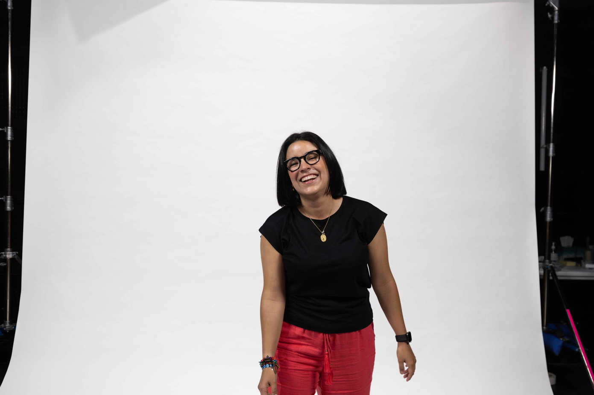

# Bea Mendez Gandica - Personal Portfolio Website



A modern, responsive personal portfolio website showcasing the achievements, work, and impact of **Bea Mendez Gandica** - Program Manager at Microsoft, Founder & CEO of Nuevo Foundation, and the first Venezuelan-American to have a statue in the United States.

## 🌟 About

This website tells the story of Bea Mendez Gandica, a Venezuelan-American technology leader who has dedicated her career to breaking barriers and creating opportunities for underrepresented communities in STEM. Born in San Cristóbal, Venezuela, and now making history in the United States, this portfolio showcases her journey from immigrant to industry leader.

### Key Highlights
- **22,762+ students** impacted across **39 countries and territories**
- **First Venezuelan-American** to have a statue in the United States (Smithsonian AAAS IF/THEN Collection)
- **10+ years** at Microsoft as a Program Manager
- **Founder & CEO** of Nuevo Foundation (2018-present)
- **International speaker** and STEM advocate

## 🚀 Features

### ✨ Modern Design
- **Responsive Layout**: Optimized for all device sizes (mobile, tablet, desktop)
- **Professional UI/UX**: Clean, modern design with smooth animations
- **Accessibility**: Semantic HTML and ARIA labels for screen readers
- **Performance Optimized**: Fast loading with optimized images and assets

### 🎯 Content Sections
- **Hero Section**: Introduction with call-to-action buttons
- **About**: Personal story and background
- **Expertise**: Technical skills and areas of focus
- **Achievements**: Awards, recognitions, and milestones
- **Nuevo Foundation**: Details about her nonprofit organization
- **Speaking**: Information about talks and presentations
- **Media Coverage**: Press mentions and features
- **Gallery**: Professional photos and event images
- **Connect**: Contact information and social links

### 🛠️ Technical Features
- **Smooth Scrolling**: Enhanced navigation experience
- **Mobile Menu**: Responsive hamburger navigation
- **Scroll Animations**: Elements fade in as you scroll
- **Social Sharing**: Open Graph and Twitter Card meta tags
- **SEO Optimized**: Proper meta descriptions and structured content

## 💻 Technology Stack

### Frontend
- **HTML5**: Semantic markup with accessibility features
- **CSS3**: Custom properties, Flexbox, Grid, and animations
- **Vanilla JavaScript**: No frameworks - pure, lightweight JS
- **Google Fonts**: Inter and Playfair Display typography

### Design System
- **Color Palette**: Professional blue (#0a2540) and gold (#f59e0b) scheme
- **Typography**: Modern font pairing for readability and elegance
- **Responsive Breakpoints**: Mobile-first approach
- **Component-based CSS**: Modular and maintainable styles

## 📁 Project Structure

```
beagandica.com/
├── index.html          # Main HTML file
├── styles.css          # All CSS styles and animations
├── script.js           # JavaScript functionality
├── assets/
│   └── images/         # Photos and graphics
│       ├── favicon.png
│       ├── bea-prof-1.png
│       ├── Bea NF_Meany_20250207.jpg
│       ├── Bea NF_Meany_2_20250207.jpg
│       ├── Bea SDCC AI Panel 2025.jpg
│       ├── Bea-statue-PR.jpeg
│       ├── Aspire-Talks-142.jpg
│       ├── Eller_Homecoming_Awards_2023_AZ_Inn_Julius_Schlosburg_20231103_1111.jpg
│       └── NuviGif_Party.gif
└── README.md           # This documentation
```

## 🚀 Getting Started

### Prerequisites
- A modern web browser (Chrome, Firefox, Safari, Edge)
- A local web server (optional, for development)

### Installation
1. **Clone the repository**
   ```bash
   git clone https://github.com/beagandica/beagandica.com.git
   cd beagandica.com
   ```

2. **Open the website**
   - **Option A**: Double-click `index.html` to open in your default browser
   - **Option B**: Use a local server for better performance:
     ```bash
     # Using Python
     python -m http.server 8000
     
     # Using Node.js (http-server)
     npx http-server
     
     # Using PHP
     php -S localhost:8000
     ```

3. **View the website**
   - Navigate to `http://localhost:8000` if using a local server
   - Or simply open the file directly in your browser

## 🎨 Customization

### Colors
The website uses CSS custom properties for easy theming. Update these values in `styles.css`:

```css
:root {
    --primary: #0a2540;        /* Main brand color */
    --secondary: #f59e0b;      /* Accent color */
    --dark: #0a2540;          /* Text color */
    --light: #f8fafc;         /* Background color */
    --white: #ffffff;         /* Pure white */
}
```

### Content
- **Text Content**: Edit the HTML directly in `index.html`
- **Images**: Replace files in `assets/images/` and update references in HTML
- **Social Links**: Update the connect section with your preferred contact methods

### Styling
- **Layout**: Modify CSS Grid and Flexbox properties in `styles.css`
- **Animations**: Adjust transition timings and effects
- **Typography**: Change font families in the Google Fonts import

## 📱 Responsive Design

The website is fully responsive with breakpoints at:
- **Mobile**: < 768px
- **Tablet**: 768px - 1023px  
- **Desktop**: ≥ 1024px

All images are optimized and responsive, with proper alt text for accessibility.

## 🌐 Deployment

### GitHub Pages
This site is ready for deployment on GitHub Pages:

1. Push your code to a GitHub repository
2. Go to Settings → Pages in your repository
3. Select "Deploy from a branch" and choose "main"
4. Your site will be available at `https://[username].github.io/[repository-name]`

### Other Hosting Options
- **Netlify**: Drag and drop the project folder
- **Vercel**: Connect your GitHub repository
- **Traditional Hosting**: Upload files via FTP to your web server

## 🤝 Contributing

While this is a personal portfolio website, contributions for bug fixes, improvements, or accessibility enhancements are welcome:

1. Fork the repository
2. Create a feature branch (`git checkout -b feature/improvement`)
3. Commit your changes (`git commit -am 'Add some improvement'`)
4. Push to the branch (`git push origin feature/improvement`)
5. Open a Pull Request

## 📞 Contact

**Bea Mendez Gandica**

The best way to reach out is via **LinkedIn**: [Connect with Bea on LinkedIn](https://linkedin.com/in/beatrismendezgandica)

### Other Ways to Connect:
- **Professional Speaking Inquiries**: Through LinkedIn messaging
- **Nuevo Foundation**: Learn more at [nuevofoundation.org](https://nuevofoundation.org)


## 🙏 Acknowledgments

- **Typography**: Google Fonts (Inter & Playfair Display)
- **Icons**: Custom SVG icons and Font Awesome
- **Photography**: Professional photos from various events and sessions
- **Inspiration**: The amazing students and communities that drive this mission

---

*"Si usted tiene, usted tiene que dar." - If you have, you have to give.* - Bea's grandfather, Papito

---

**Built with ❤️ by Bea Mendez Gandica**  
*Rewriting the rules of the world, one student at a time.*