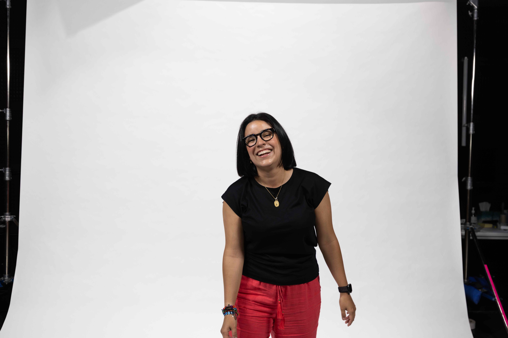

# Bea Mendez Gandica - Personal Portfolio Website



A bilingual personal website for **Bea Mendez Gandica**, Senior Program Manager at Microsoft and Founder & CEO of Nuevo Foundation. The central message, "I build platforms that widen access," connects her cloud platform work, open learning resources, and leadership approach.

## 🌟 About

This website tells the story of Bea Mendez Gandica, a Venezuelan-American technology leader who has dedicated her career to breaking barriers and creating opportunities for underrepresented communities in STEM. Born in San Cristóbal, Venezuela, and now making history in the United States, this portfolio showcases her journey from immigrant to industry leader.

### Key Highlights
- **23,737+ students** taught, using the student count on Nuevo Foundation's homepage
- **41 workshop countries and territories** (35 countries + 6 territories), using the detailed 4/13/2026 global reach post
- **86 countries + 6 territories reached** through workshops and website visits combined, not a workshop attendance count
- **First Venezuelan-American** to have a statue in the United States (Smithsonian AAAS IF/THEN Collection)
- **10+ years** at Microsoft as a Program Manager
- **Founder & CEO** of Nuevo Foundation (2018-present)
- **International speaker** and STEM advocate

## 🚀 Features

### ✨ Modern Design
- **Responsive Layout**: Optimized for all device sizes (mobile, tablet, desktop)
- **Professional UI/UX**: Clean, modern design with smooth animations
- **Accessibility**: Semantic HTML and ARIA labels for screen readers
- **Performance Optimized**: Fast loading with optimized images and assets

### 🎯 Content Sections
- **Hero Section**: Introduction with call-to-action buttons
- **About**: Personal story, cross-cultural background, and three leadership lessons
- **Expertise**: Technical skills and areas of focus
- **Achievements**: Awards, recognitions, and milestones
- **Nuevo Foundation**: Details about her nonprofit organization
- **Speaking**: Information about talks and presentations
- **Media Coverage**: Press mentions and features
- **Gallery**: Professional photos and event images
- **Connect**: Contact information and social links

### 🛠️ Technical Features
- **Smooth Scrolling**: Enhanced navigation experience
- **Mobile Menu**: Responsive hamburger navigation
- **Scroll Animations**: Elements fade in as you scroll
- **Social Sharing**: Open Graph and Twitter Card meta tags
- **SEO Optimized**: Proper meta descriptions and structured content
- **Bilingual Content**: English and Spanish text, accessible labels, and metadata
- **Lightweight Photos**: Resized WebP images, lazy-loaded below the hero

## 💻 Technology Stack

### Frontend
- **HTML5**: Semantic markup with accessibility features
- **CSS3**: Custom properties, Flexbox, Grid, and animations
- **Vanilla JavaScript**: No frameworks - pure, lightweight JS
- **Google Fonts**: Inter and Playfair Display typography

### Design System
- **Color Palette**: Professional blue (#0a2540) and gold (#f59e0b) scheme
- **Typography**: Modern font pairing for readability and elegance
- **Responsive Breakpoints**: Mobile-first approach
- **Component-based CSS**: Modular and maintainable styles

## 📁 Project Structure

```
beagandica.com/
├── index.html          # Main HTML file
├── styles.css          # All CSS styles and animations
├── script.js           # JavaScript functionality
├── translations.js     # English and Spanish content and metadata
├── tests/
│   └── site.test.js    # Dependency-free content and asset regression tests
├── assets/
│   └── images/         # Photos and graphics
│       ├── favicon.png
│       ├── bea-prof-1.png
│       ├── Bea NF_Meany_20250207.jpg
│       ├── Bea NF_Meany_2_20250207.jpg
│       ├── Bea SDCC AI Panel 2025.jpg
│       ├── Bea-statue-PR.jpeg
│       ├── Aspire-Talks-142.jpg
│       ├── Eller_Homecoming_Awards_2023_AZ_Inn_Julius_Schlosburg_20231103_1111.jpg
│       └── NuviGif_Party.gif
└── README.md           # This documentation
```

## 🚀 Getting Started

### Prerequisites
- A modern web browser (Chrome, Firefox, Safari, Edge)
- A local web server (optional, for development)

### Installation
1. **Clone the repository**
   ```bash
   git clone https://github.com/beagandica/beagandica.com.git
   cd beagandica.com
   ```

2. **Open the website**
   - **Option A**: Double-click `index.html` to open in your default browser
   - **Option B**: Use a local server for better performance:
     ```bash
     # Using Python
     python -m http.server 8000 --bind 127.0.0.1
     
     # Using Node.js (http-server)
     npx http-server
     
     # Using PHP
     php -S localhost:8000
     ```

3. **View the website**
   - Navigate to `http://localhost:8000` if using a local server
   - Or simply open the file directly in your browser

## 🎨 Customization

### Colors
The website uses CSS custom properties for easy theming. Update these values in `styles.css`:

```css
:root {
    --primary: #0a2540;        /* Main brand color */
    --secondary: #f59e0b;      /* Accent color */
    --dark: #0a2540;          /* Text color */
    --light: #f8fafc;         /* Background color */
    --white: #ffffff;         /* Pure white */
}
```

### Content
- **Text Content**: Keep the English HTML fallback in `index.html` and both dictionaries in `translations.js` in sync. New `data-i18n`, `data-i18n-alt`, and `data-i18n-aria` keys need entries in both languages.
- **Images**: Keep originals in `assets/images/`. The page uses WebP copies with EXIF orientation applied, a maximum edge of 1600 pixels (960 for the hero), quality 82, and encoding method 6. Update `width` and `height` in HTML when replacing a photo. Gallery and mascot images use lazy loading; the hero does not. Social previews retain the original PNG at an absolute URL.
- **Social Links**: Update the connect section with your preferred contact methods
- **Travel Guides**: The Explore Guides button points to `https://beagandica.github.io/beaglobaltraveler/`.
- **Impact Figures**: Confirm dates and definitions with Nuevo Foundation before changing counts. The site distinguishes countries reached from countries and territories where workshops were taught.

### Impact sources and definitions

| Figure | Source and meaning |
|---|---|
| 23,737+ students | `https://www.nuevofoundation.org/`, the published student count. Keep the About and Nuevo counters in sync. |
| 41 workshop countries and territories | `https://www.nuevofoundation.org/blog/post/1750`, dated 4/13/2026: 35 countries + 6 territories. Bea confirmed using this detailed breakdown instead of the homepage's 33 + 6 breakdown. |
| 86 countries + 6 territories reached | The same post's deduplicated workshop and website-visitor footprint. Do not describe all these locations as places where students were taught. |
| 7 program languages; 90% say they learned to code | Nuevo Foundation's homepage. The post's languages observed in website analytics measure something different from program languages. |
| 12+ hours saved weekly | Bea's confirmed personal estimate, not a measured result for every user of these tools. |

The Forbes achievement is a **shortlist recognition and invitation** to the 2019 Forbes Under 30 Summit Europe in Berlin, not selection for the published 30 Under 30 list.

### Styling
- **Layout**: Modify CSS Grid and Flexbox properties in `styles.css`
- **Animations**: Adjust transition timings and effects
- **Typography**: Change font families in the Google Fonts import

## 📱 Responsive Design

Layout breakpoints:
- **Navigation**: Collapses at 1100px to keep English and Spanish controls in view
- **Mobile**: < 768px
- **Stacked hero**: Up to 992px
- **Desktop hero**: Above 992px

Page photos use optimized WebP copies; full-resolution originals remain available in the repository.

## Local checks

With Node.js installed, run:

```powershell
node --test tests\site.test.js
```

The tests check translation coverage and English fallback consistency, local assets and anchor targets, the travel guide destination, sharing metadata, and a combined page-photo budget below 1 MB.

For browser changes, preview both languages on desktop, tablet, and a 320px-wide phone. Check menu expansion and Escape dismissal, the logo's return-to-top action, gallery images, language persistence, and reduced-motion behavior.

## 🌐 Deployment

### GitHub Pages
This site is ready for deployment on GitHub Pages:

1. Push your code to a GitHub repository
2. Go to Settings → Pages in your repository
3. Select "Deploy from a branch" and choose "main"
4. Your site will be available at `https://[username].github.io/[repository-name]`

### Other Hosting Options
- **Netlify**: Drag and drop the project folder
- **Vercel**: Connect your GitHub repository
- **Traditional Hosting**: Upload files via FTP to your web server

## 🤝 Contributing

While this is a personal portfolio website, contributions for bug fixes, improvements, or accessibility enhancements are welcome:

1. Fork the repository
2. Create a feature branch (`git checkout -b feature/improvement`)
3. Commit your changes (`git commit -am 'Add some improvement'`)
4. Push to the branch (`git push origin feature/improvement`)
5. Open a Pull Request

## 📞 Contact

**Bea Mendez Gandica**

The best way to reach out is via **LinkedIn**: [Connect with Bea on LinkedIn](https://linkedin.com/in/beatrismendezgandica)

### Other Ways to Connect:
- **Professional Speaking Inquiries**: Through LinkedIn messaging
- **Nuevo Foundation**: Learn more at [nuevofoundation.org](https://nuevofoundation.org)


## 🙏 Acknowledgments

- **Typography**: Google Fonts (Inter & Playfair Display)
- **Icons**: Custom SVG icons and Font Awesome
- **Photography**: Professional photos from various events and sessions
- **Inspiration**: The amazing students and communities that drive this mission

---

*"Si usted tiene, usted tiene que dar." - If you have, you have to give.* - Bea's grandfather, Papito

---

**Built with ❤️ by Bea Mendez Gandica**  
*Rewriting the rules of the world, one student at a time.*